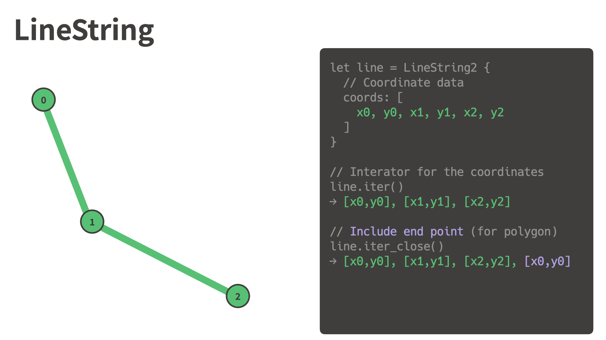
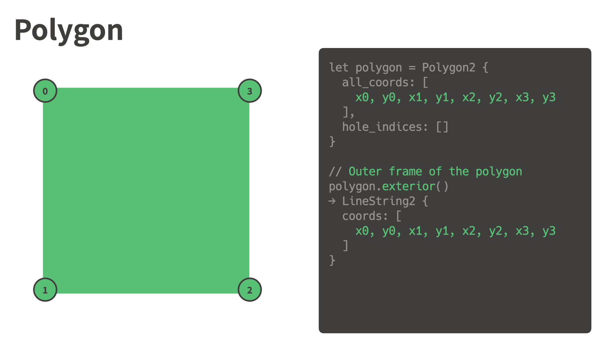
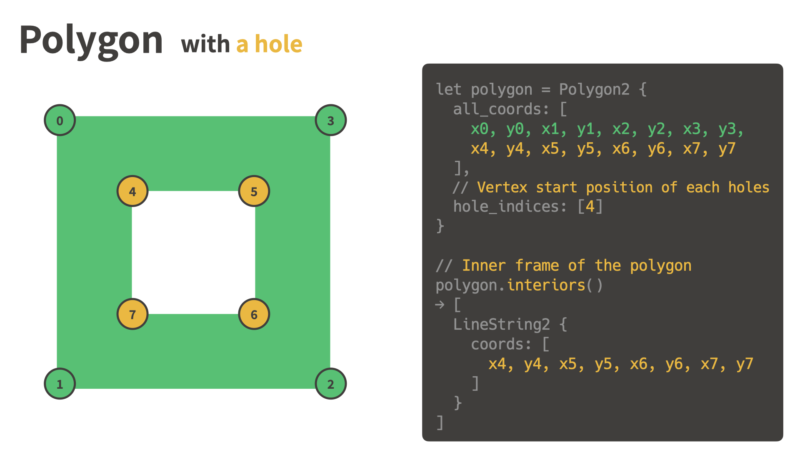
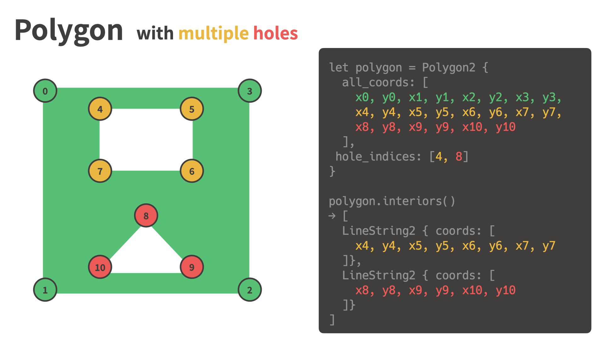
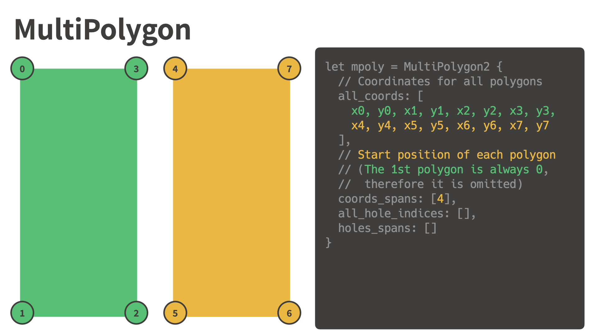
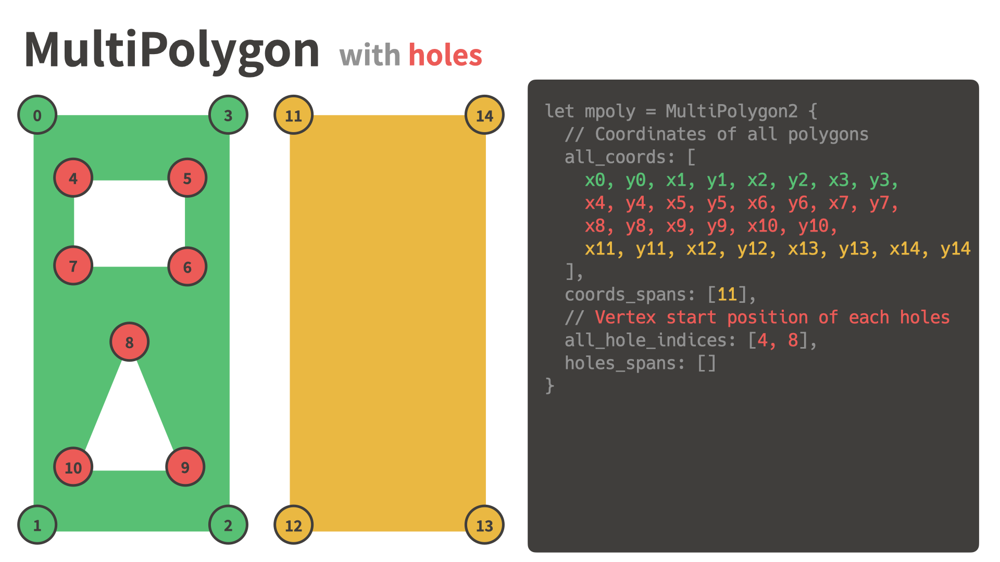
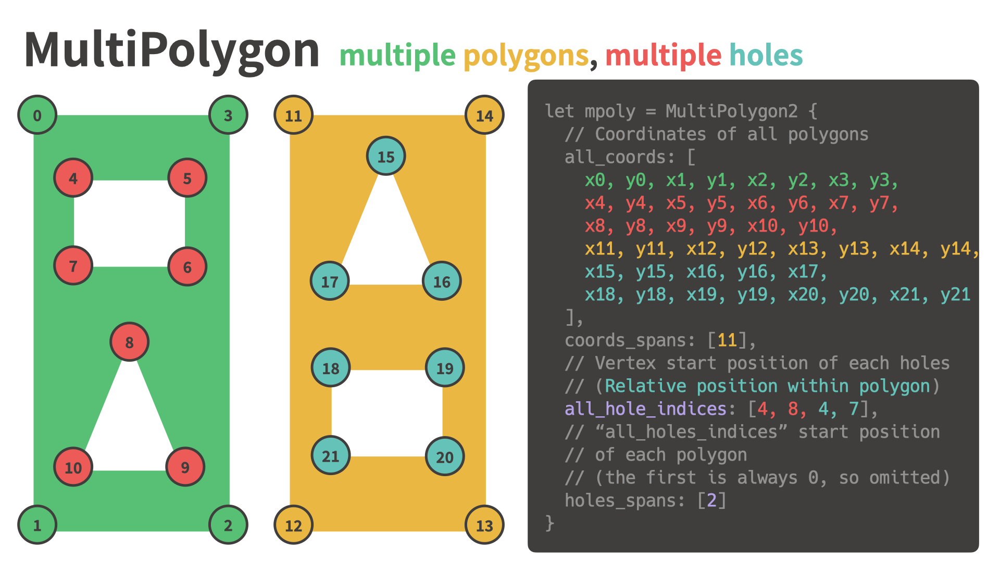

# flatgeom

Geospatial geometry primitives (e.g., Polygons, MultiPolygons) that use flat data structures instead of jagged arrays for efficient serialization and deserialization.

## Visual examples of the data structure

### LineString

### Polygon

### Polygon with a hole

### Polygon with multiple holes

### MultiPolygon

### MultiPolygon with holes

### Multiple polygons, multiple holes

